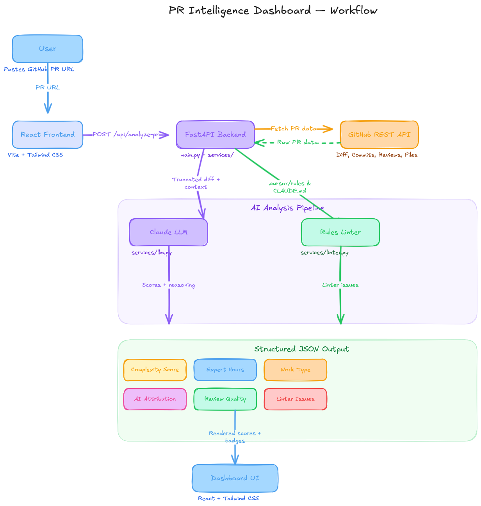

# PR Intelligence Dashboard Prototype

A sleek, single‑page dashboard that analyzes GitHub Pull Requests using LLM‑powered intelligence.  
Enter a public GitHub PR URL and instantly receive a structured intelligence report covering complexity, effort estimation, AI attribution, review quality, and more.

## Detailed Documentation

[](https://deepwiki.com/shivamshinde123/PR-Intelligence-Dashboard-Prototype)

---

## 🎬 Demo

[](https://youtube.com/shorts/S-Ez6QgID54?si=5lUYpv7hnMaJ7VyM)

> 🎥 **Click the image above** to watch the demo on YouTube.

---

## 🏗️ Architecture



The diagram above illustrates the end‑to‑end data flow:  
1. **User** pastes a GitHub PR URL into the **React Frontend**  
2. The frontend sends a `POST /api/analyze-pr` request to the **FastAPI Backend**  
3. The backend fetches PR data (diff, commits, files, reviews) from the **GitHub REST API**  
4. Truncated PR data is forwarded to **Claude LLM** for scoring, while AI rule files are validated by the **Rules Linter**  
5. The combined **structured JSON output** (complexity, expert hours, work type, AI attribution, review quality, linter issues) is rendered on the **Dashboard UI**

---

## ✨ Features

- **Complexity Score & Expert Hours** — LLM‑estimated effort for each PR  
- **Work‑Type Classification** — feature / bug / tech‑debt / maintenance  
- **AI Attribution Confidence** — probability the code was AI‑generated  
- **Review Quality Score** — how actionable and thorough the review feedback is  
- **AI Rules Linter** — validates `.cursor/rules` & `CLAUDE.md` files  
- **Structured Reasoning** — 2‑4 sentence explanation of every score  
- **Exportable Summary** — one‑click download of the full report as a text file  

---

## 🔧 Tech Stack

| Layer | Technology |
|-------|-----------|
| **Backend** | Python 3.11+, FastAPI, Uvicorn, httpx, Pydantic |
| **Frontend** | React 18, Vite 5, Tailwind CSS 3, PostCSS, Autoprefixer |
| **LLM** | Anthropic Claude (claude‑sonnet‑4‑20250514) via Messages API |
| **Data Source** | GitHub REST API v3 |
| **Config** | python‑dotenv (`.env` file) |
| **Package Manager** | uv (Python), npm (Node) |

---

## 🧠 How Scoring Works

All numeric scores are produced by **Claude (Anthropic's LLM)** via a carefully engineered system prompt — not hard‑coded formulas. This gives context‑aware, human‑like judgments that a simple line‑count formula would miss.

### Pipeline Overview

```
GitHub PR URL
     │
     ▼
┌─────────────────────────┐
│  1. GitHub API Fetcher   │  Diff, commits, files, reviews
│     (services/github.py) │
└────────────┬────────────┘
             │  truncated to fit token limits
             ▼
┌─────────────────────────┐
│  2. Claude LLM Analysis  │  System prompt + PR data → JSON
│     (services/llm.py)    │
└────────────┬────────────┘
             │
             ▼
┌─────────────────────────┐
│  3. AI Rules Linter      │  Checks .cursor/rules & CLAUDE.md
│     (services/linter.py) │
└────────────┬────────────┘
             │
             ▼
      JSON Response → Frontend Dashboard
```

### Data Collection

The backend fetches four pieces of data from the GitHub API for every PR:

| Data | Description | Truncation Limit |
|------|-------------|:----------------:|
| **Diff** | Full unified diff of all file changes | 12 000 chars |
| **Commits** | Commit messages and metadata | 2 000 chars |
| **Files Changed** | File names, additions, deletions, patch info | 4 000 chars |
| **Review Comments** | Inline and top‑level reviewer feedback | 3 000 chars |

Large PRs are automatically truncated to stay within LLM token limits while preserving the most informative content.

---

### 📊 Complexity Score (0–10)

**What it measures:** How intricate and involved the PR's changes are.

**What Claude evaluates:**
- **Size & breadth of the diff** — number of lines and files changed  
- **Nature of the changes** — new logic, refactors, dependency bumps, config tweaks  
- **Semantic complexity** — algorithms, concurrency, error handling vs. boilerplate  
- **Commit messages** — intent signals like "add feature" vs. "fix typo"  
- **Cross‑cutting concerns** — does 1 change ripple across many files?  

**Scoring guidelines:**

| Score | Meaning | Example PRs |
|:-----:|---------|-------------|
| **0–2** | Trivial | Typo fixes, version bumps, dependency pins |
| **3–4** | Low | Small bug fixes, config changes, minor refactors |
| **5–6** | Moderate | New endpoints, component additions, test suites |
| **7–8** | High | Multi‑file features, architectural changes, complex logic |
| **9–10** | Very High | Large‑scale rewrites, new subsystems, concurrency work |

---

### ⏱️ Expert Hours

**What it measures:** Estimated wall‑clock hours a **senior engineer** would need to produce the same work from scratch.

**How Claude estimates it:**
- Reviews the diff to gauge the amount of *non‑trivial* code written  
- Considers setup work implied by the changes (research, design, testing)  
- Factors in the cognitive load of the domain (e.g., auth logic vs. UI tweaks)  
- Accounts for iteration visible in commit history and review rounds  

**Typical ranges:**

| Expert Hours | What it looks like |
|:------------:|-------------------|
| **0.25–1 h** | One‑liner fixes, doc typos, dependency pins |
| **1–3 h** | Small bug fixes, config adjustments |
| **3–6 h** | New API endpoint, new React component with tests |
| **6–12 h** | Multi‑file feature, significant refactor |
| **12+ h** | Full subsystem, complex algorithm, architectural rework |

---

### 🤖 AI Attribution Confidence (0.0–1.0)

**What it measures:** The probability that the code in the PR was **AI‑generated** (e.g., by Copilot, ChatGPT, Cursor, etc.).

This uses a **two‑layer approach**:

#### Layer 1 — Git Co‑Author Detection (Heuristic)

Before calling the LLM, the backend scans commit data for hard evidence of AI involvement:

- **`Co-authored-by:` trailers** — e.g., `Co-authored-by: GitHub Copilot`, `Co-authored-by: Cursor`  
- **Known AI committer emails** — `copilot@github.com`, bot `noreply` addresses  
- **Bot committer names** — names matching `[bot]`, `copilot`, `cursor`  

If any signal is detected, the confidence floor is raised to **0.6** regardless of what the LLM says — because git metadata is harder evidence than stylistic guessing.

#### Layer 2 — LLM Stylistic Analysis

Claude also evaluates the diff for softer signals:

- **Overly uniform formatting** — AI produces consistently styled code without human variation  
- **Verbose boilerplate comments** — lines like `// Initialize the variable` that add no value  
- **Structural tells** — repetitive patterns, cookie‑cutter test structures  
- **Naming conventions** — overly conventional, "textbook" variable/function names  

The two layers are combined: git signals provide the **evidence floor**, and LLM analysis can push confidence **higher** based on stylistic patterns.

| Confidence | Interpretation |
|:----------:|---------------|
| **0.0–0.2** | Almost certainly human‑written |
| **0.2–0.4** | Likely human, some AI‑like patterns |
| **0.4–0.6** | Mixed — could be AI‑assisted |
| **0.6–0.8** | Likely AI‑generated, possibly human‑edited |
| **0.8–1.0** | Almost certainly AI‑generated |

---

### 📝 Review Quality Score (0–10)

**What it measures:** How thorough, actionable, and constructive the review comments are.

**What Claude evaluates:**
- **Specificity** — Do comments reference exact lines and explain *why* something needs to change?  
- **Actionability** — Are there clear suggestions, not just vague "looks good" or "needs work"?  
- **Tone** — Constructive and respectful vs. dismissive or hostile  
- **Coverage** — Do reviews address the critical parts of the diff or only cosmetic issues?  
- **Depth** — Back‑and‑forth discussion vs. a single rubber‑stamp approval  

| Score | Meaning |
|:-----:|---------|
| **0** | No review comments at all |
| **1–3** | Minimal — "LGTM" or vague one‑liners |
| **4–6** | Decent — some specific feedback but gaps in coverage |
| **7–8** | Thorough — line‑level comments with clear reasoning |
| **9–10** | Exceptional — deep technical discussion, alternative solutions proposed |

---

### 🔍 AI Rules Linter

The linter is a **deterministic, rule‑based** check (not LLM‑based) that runs on files touched by the PR.

**What it checks:**
1. Scans the PR's changed file list for `.cursor/rules` and `CLAUDE.md` files  
2. Fetches the raw file content via GitHub's `raw_url`  
3. Validates the format:
   - Attempts to parse as **JSON** — if valid, passes  
   - Falls back to **YAML‑like** check (looks for `:` key‑value separators)  
   - If neither matches, flags: *"does not appear to be valid JSON or YAML"*  

**Why this matters:** Teams using AI coding tools (Cursor, Claude Code, Copilot) often configure rules files. A malformed rules file silently breaks the AI's behavior, so the linter catches this early.

---

### 💡 Why LLM‑Based Instead of a Formula?

- **Context‑aware** — The model weighs *semantic* meaning ("upgrade dependency" vs. "introduce async endpoint"), which line‑count formulas miss  
- **Human‑like judgment** — Claude is trained on vast amounts of code‑review data, producing estimates that resemble those of a senior engineer  
- **Easily tunable** — Adjust the scoring bias by editing the system prompt in `backend/services/llm.py` — zero code changes  
- **Transparent reasoning** — Every analysis includes a `reasoning` field explaining *why* the model chose those scores  

---

## 🌐 API Reference

### `POST /api/analyze-pr`

Analyze a public GitHub Pull Request.

**Request body** (`application/json`):

```json
{
  "pr_url": "https://github.com/owner/repo/pull/123"
}
```

**Success response** (`200 OK`):

```json
{
  "complexity_score": 5.0,
  "expert_hours": 3.5,
  "work_type": "feature",
  "ai_attribution_confidence": 0.25,
  "review_quality_score": 7.0,
  "linter_issues": [],
  "reasoning": "This PR adds a new authentication module with JWT support..."
}
```

**Response fields:**

| Field | Type | Range | Description |
|-------|------|-------|-------------|
| `complexity_score` | float | 0–10 | Overall PR complexity |
| `expert_hours` | float | 0+ | Estimated senior‑engineer hours |
| `work_type` | string | `feature` / `bug` / `tech_debt` / `maintenance` | Classification of the change |
| `ai_attribution_confidence` | float | 0–1 | Probability code is AI‑generated |
| `review_quality_score` | float | 0–10 | Quality of review comments |
| `linter_issues` | string[] | — | Issues found in AI rule files |
| `reasoning` | string | — | 2‑4 sentence explanation of all scores |

**Error responses:**

| Status | When |
|--------|------|
| `400` | Invalid or unparseable PR URL |
| `502` | GitHub API or Claude API call failed |
| `500` | Claude API key not configured or response parse error |

---

## ⚙️ Environment Variables

Create a `.env` file in the project root (copy from `.env.example`):

| Variable | Required | Description |
|----------|:--------:|-------------|
| `CLAUDE_API_KEY` | ✅ Yes | Anthropic API key for Claude LLM analysis |
| `GITHUB_TOKEN` | ❌ Optional | GitHub personal access token — avoids rate‑limiting (60 → 5 000 req/hr) |

```env
CLAUDE_API_KEY=sk-ant-api03-your-key-here
GITHUB_TOKEN=ghp_your-token-here
```

> **⚠️ Security:** Never commit `.env` to version control. The `.gitignore` is already configured to exclude it.

---

## 📦 Prerequisites

- **Node.js ≥ 20** (for the Vite/React frontend)  
- **Python ≥ 3.11** (for the FastAPI backend)  
- **uv** — fast Python package manager ([install guide](https://docs.astral.sh/uv/getting-started/installation/))  
- **Anthropic Claude API key** ([get one here](https://console.anthropic.com/))  
- **GitHub Personal Access Token** (optional — [create one here](https://github.com/settings/tokens))  

## 🛠️ Setup

```bash
# Navigate to project root
cd "PR Intelligence Dashboard Prototype"

# Install backend dependencies
uv pip install -r backend/requirements.txt

# Copy env template and fill in your keys
cp .env.example .env
# Edit .env with your CLAUDE_API_KEY (and optionally GITHUB_TOKEN)

# Install frontend dependencies
cd frontend
npm install
```

## 🚀 Running

Start both servers in **separate terminals**:

### Backend

```bash
cd backend
uvicorn main:app --reload
```

The API server starts at **http://127.0.0.1:8000**.  
The `--reload` flag enables auto‑restart on code changes.

### Frontend

```bash
cd frontend
npm run dev
```

The Vite dev server starts at **http://localhost:5173**.  
API requests are automatically proxied to the backend via `vite.config.js`.

Open **http://localhost:5173** in your browser, paste any public GitHub PR URL, and watch the dashboard populate.

## 🧪 Quick Test

```bash
curl -X POST http://127.0.0.1:8000/api/analyze-pr \
  -H "Content-Type: application/json" \
  -d '{"pr_url":"https://github.com/fastapi/fastapi/pull/13500"}'
```

---

## 📁 Project Structure

```
PR Intelligence Dashboard Prototype/
├── .env.example              # Template for API keys
├── .gitignore                # Excludes .env, node_modules, dist, etc.
├── README.md                 # This file
├── backend/
│   ├── main.py               # FastAPI app, CORS, /api/analyze-pr endpoint
│   ├── requirements.txt      # Python deps (fastapi, uvicorn, httpx, etc.)
│   └── services/
│       ├── __init__.py
│       ├── github.py         # GitHub API — fetch diff, commits, files, reviews
│       ├── llm.py            # Claude Messages API — scoring & analysis
│       └── linter.py         # Deterministic AI rules file linter
└── frontend/
    ├── index.html            # Vite HTML entry point
    ├── package.json          # Node deps (react, vite, tailwindcss, etc.)
    ├── vite.config.js        # Vite config with backend API proxy
    ├── tailwind.config.js    # Tailwind theme customization
    ├── postcss.config.js     # PostCSS plugins (Tailwind + Autoprefixer)
    └── src/
        ├── main.jsx          # React entry point
        ├── index.css         # Global styles — premium dark theme, animations
        ├── api.js            # Frontend API helper (fetch wrapper)
        ├── App.jsx           # Main app — URL input, loading, error states
        └── components/
            └── Dashboard.jsx # Analysis results — tiles, bars, badges, export
```

---

## ⚠️ Limitations & Known Issues

| Limitation | Detail |
|-----------|--------|
| **Public PRs only** | Private repos require a GitHub token with `repo` scope (not just `public_repo`) |
| **Diff truncation** | PRs with diffs > 12 000 chars are truncated — some context may be lost for very large PRs |
| **LLM variability** | Claude's scores may vary slightly between runs (temperature is set to 0 to minimize this) |
| **Rate limits** | Without a `GITHUB_TOKEN`, GitHub allows only 60 requests/hour |
| **Linter scope** | The AI rules linter only checks `.cursor/rules` and `CLAUDE.md` — other rule systems are not yet supported |
| **In‑memory cache only** | Results are cached in a Python dict — cache is lost on server restart (consider Redis for production) |

---

## 🗺️ Future Improvements

- [x] ~~Add result caching (Redis / in‑memory) to avoid redundant API calls~~ — ✅ in‑memory cache implemented  
- [ ] Support private repositories via OAuth flow  
- [ ] Historical trend tracking — compare scores across PRs in the same repo  
- [ ] Batch analysis — analyze all open PRs in a repo at once  
- [ ] More linter rules — `.github/copilot-instructions.md`, ESLint AI configs  
- [ ] Deploy to Vercel (frontend) + Railway (backend)  

---

## 📄 License

MIT — free for personal and commercial use.
